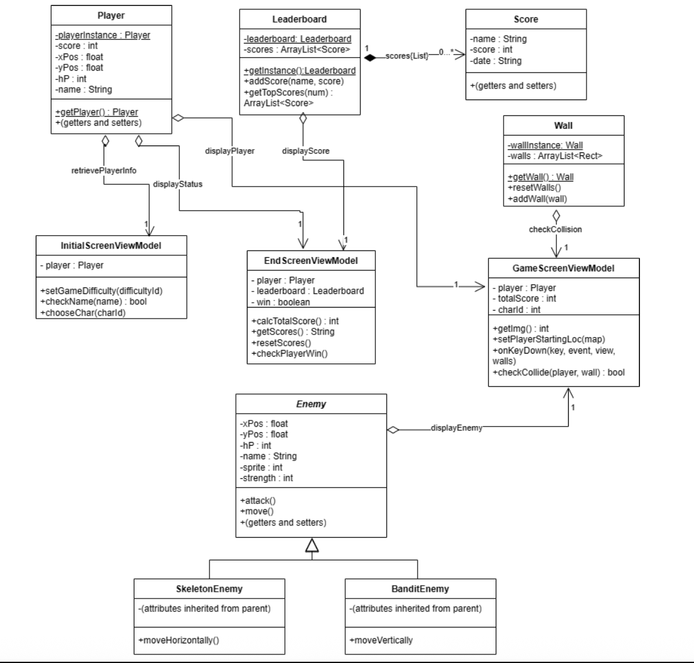
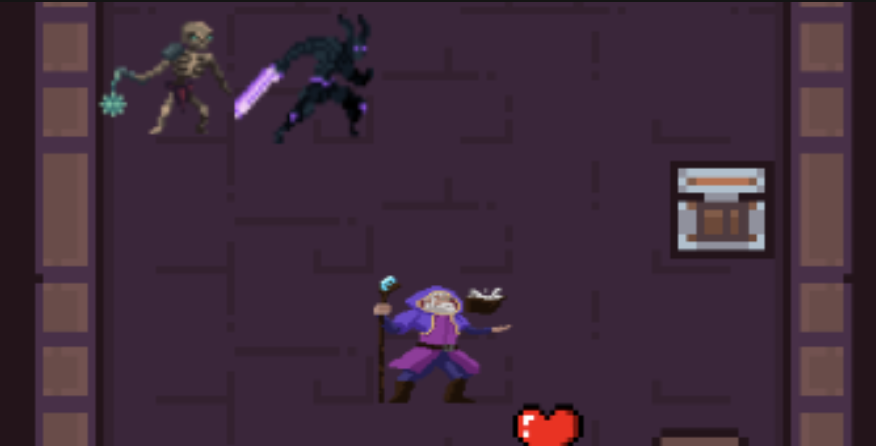

# CS2340A Team 11 — Dungeon Survival Game

A 2D top-down survival game built for CS 2340 (Objects and Design), developed as a native Android application in Java. The project applies coursework concepts — **MVVM architecture**, **software design patterns**, and **SOLID/GRASP principles** — to a mobile game.

## Gameplay Overview

Players configure a run (name, difficulty, character), then fight through a sequence of maps collecting power-ups and defeating enemies before reaching a final boss encounter. Scores are submitted to a cloud-backed leaderboard (Firebase).

**Screen flow:** Start Screen → Initial Config (name / difficulty / character select) → Game Screen (Room Maps with enemies) → Ending / Game Over → Leaderboard

## Design and Preview





## Tech Stack

- **Language:** Java
- **Platform:** Android SDK (ConstraintLayout, Material Components)
- **Backend:** Firebase Authentication & Cloud Firestore (leaderboard)
- **Testing:** JUnit

## Architecture: MVVM

The codebase is organized into three layers, matching Android's recommended MVVM architecture:

```
app/src/main/java/com/example/cs2340a_team11/
├── Model/          # Game state & business logic (Player, Enemy, PowerUp, Leaderboard)
├── View/           # Activities and custom views — rendering & user input only
└── ViewModel/      # Communication between Model and View (LiveData)
```

- **Model** owns game state and rules and knows nothing about Android UI.
- **View** (`Activities/`, `EntityViews/`, `Maps/`) is responsible only for rendering and forwarding input.
- **ViewModel** (e.g. [`GameScreenViewModel`](app/src/main/java/com/example/cs2340a_team11/ViewModel/GameScreenViewModel.java), [`StartScreenViewModel`](app/src/main/java/com/example/cs2340a_team11/ViewModel/StartScreenViewModel.java)) exposes observable state via `LiveData`, keeping the View layer free of business logic and independently testable.

## Software Design Patterns

| Pattern | Where | Why it's used |
|---|---|---|
| **Singleton** | [`Player`](app/src/main/java/com/example/cs2340a_team11/Model/Player.java), [`EnemyList`](app/src/main/java/com/example/cs2340a_team11/Model/EnemyList.java), [`Wall`](app/src/main/java/com/example/cs2340a_team11/Model/Wall.java), [`Leaderboard`](app/src/main/java/com/example/cs2340a_team11/Model/Leaderboard.java) | Single source of truth for global game state shared across activities |
| **Factory Method** | [`EnemyFactory`](app/src/main/java/com/example/cs2340a_team11/Model/Factories/EnemyFactory.java) → `BanditFactory`, `SkeletonFactory`, `EvilWizardFactory`, `NightborneidleFactory` | New enemy types are added by creating a new factory, without touching existing spawn logic |
| **Strategy** | [`MovementStrategy`](app/src/main/java/com/example/cs2340a_team11/ViewModel/Collisions/MovementStrategy.java) → `MoveUpStrategy`, `MoveDownStrategy`, `MoveLeftStrategy`, `MoveRightStrategy` | Movement/collision resolution is swappable per direction |
| **Observer** | [`CollisionObserver`](app/src/main/java/com/example/cs2340a_team11/ViewModel/Collisions/CollisionObserver.java) → [`CollisionHandler`](app/src/main/java/com/example/cs2340a_team11/ViewModel/Collisions/CollisionHandler.java) | Collision events are announced to handlers/subscribers |
| **Decorator** | [`PowerUpSpriteDecorator`](app/src/main/java/com/example/cs2340a_team11/View/PowerUpViews/Sprites/PowerUpSpriteDecorator.java) → `CoinSprite`, `HealthSprite`, `InvincibilitySprite` | Sprite rendering is layered onto power-up models without modifying their  logic |
| **Template Method** | [`PowerUp.powerUpAbility()`](app/src/main/java/com/example/cs2340a_team11/Model/PowerUpModels/PowerUp.java), `EnemyFactory.prepareEnemy()` | Shared setup steps are fixed in the base class; subclasses fill in respective behavior |

## SOLID Principles in Practice

- **Single Responsibility** — Each ViewModel handles one screen's state; each concrete `EnemyFactory` builds exactly one enemy type; `CollisionHandler` only resolves collisions.
- **Open/Closed** — New enemies (`Enemy` subclasses + factory) or new movement directions (`MovementStrategy`) can be added without editing what's already in-place.
- **Liskov Substitution** — Any `Enemy` subclass (`Bandit`, `Skeleton`, `EvilWizard`, `Nightborneidle`) or `PowerUp` subclass can be used wherever the base type is expected, with no special-casing.
- **Interface Segregation** — `MovementStrategy`, `CollisionObserver`, and `BitmapInterface` are each small and focused, rather than one large "game behavior" interface.
- **Dependency Inversion** — `CollisionHandler` depends on the `MovementStrategy` abstraction, not on concrete direction classes; ViewModels depend on Model abstractions rather than concrete UI logic.

## Project Structure

```
app/src/main/java/com/example/cs2340a_team11/
├── Model/
│   ├── Enemies/          # Enemy hierarchy (Bandit, Skeleton, EvilWizard, Nightborneidle)
│   ├── Factories/        # Enemy Factory Method implementations
│   ├── PowerUpModels/    # PowerUp hierarchy
│   ├── Player.java       # Singleton — player state
│   ├── EnemyList.java    # Singleton — active enemies in a room
│   ├── Wall.java         # Singleton — collision boundaries
│   └── Leaderboard.java  # Singleton — score persistence (Firestore)
├── View/
│   ├── Activities/       # Screens (Start, Config, Game, Pause, End, GameOver)
│   ├── Maps/             # Map-specific activities and rendering
│   ├── EntityViews/      # Custom Views for Player/Enemies
│   └── PowerUpViews/     # Sprite decorators for power-ups
└── ViewModel/
    ├── Collisions/       # Strategy + Observer pattern implementation
    └── *ViewModel.java   # Per-screen ViewModels (LiveData-backed)
```

